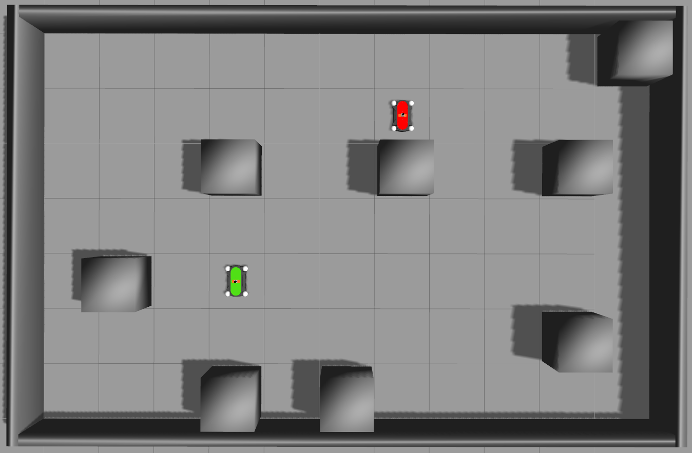

# DESPOT Tutorials



In this tutorial, we present an example of using [DESPOT](https://github.com/AdaCompNUS/despot) with real-robots via ROS. We present a slightly modified version of the *Laser Tag* problem: a robot tries to find and tag a target which intentionally runs away inside an known environment. The robot is equiped with a noisy laser-range sensor to measure distances in eight directions. Initially, the robot is aware of neither the target's location nor its own location. In each step, the robot can move to the four adjacent positions. When the robot is adjacent to the target, it can call 'Tag' to terminate a successful pursuit. The simulation consists of two holonomic robots ([KUKA Youbot](http://www.youbot-store.com/)) inside a [Gazebo](http://gazebosim.org/) environment resembling the problem world described in DESPOT paper (Page 20) [1].


[1] N. Ye, A. Somani, D. Hsu, and W. Lee. [**DESPOT: Online POMDP planning with regularization**](http://bigbird.comp.nus.edu.sg/m2ap/wordpress/wp-content/uploads/2017/08/jair14.pdf). J. Artificial Intelligence Research, 58:231–266, 2017.

[Copyright © 2014-2017 by National University of Singapore](http://motion.comp.nus.edu.sg/).

## Requirements

Tested Operating Systems:

| Ubuntu 14.04     
| :-------------: 
|[](https://semaphoreapp.com/boennemann/badges)    

Dependencies: DESPOT, ROS Melodic, Boost 1.55+

## Prerequisites

Install [ROS Indigo](http://wiki.ros.org/indigo/Installation/Ubuntu).
We recommend the `ros-indigo-desktop-full` version which includes Gazebo.  

Install the latest DESPOT using [CMakeLists](https://github.com/AdaCompNUS/despot#cmakelists). Make sure that DESPOT binaries and header files are installed.
```bash
$ cd <latest_despot_repo>
$ git checkout API_redesign # temporary, will be merged into master
$ mkdir build; cd build

$ cmake -DCMAKE_BUILD_TYPE=Release ../ 
$ make
$ sudo make install
```

Install BOOST libraries with `sudo apt-get install libboost-all-dev` 

## Installation

If you haven't sourced your ROS environment, run:
```bash
$ source /opt/ros/indigo/setup.bash OR <existing_workspace>/devel/setup.bash
```

Setup a fresh catkin workspace for **despot_tutorials**:

```bash
$ mkdir -p ~/despot_ws/src
$ cd ~/despot_ws/
$ catkin_make 
$ source devel/setup.bash
```

Clone the repository:
```bash
$ cd ~/despot_ws/src
$ git clone https://github.com/AdaCompNUS/despot_tutorials.git
```

Compile:
```bash
cd ~/despot_ws
catkin_make -DCMAKE_BUILD_TYPE=Release
```

## Usage

Launch the Gazebo environment and robot controllers:
```bash
$ roslaunch laser_tag laser_tag.launch R1_noise:=0.5
```

On a separate terminal, run the POMDP planner:
```bash
$ rosrun laser_tag pomdp_planner
```

You should see a 3D 7x11 grid world with two Youbots. The green robot should chase the red robot until 'Tag' is called. The `R1_noise` parameter specifies the gaussian noise (standard deviation in meters) of the green robot's laser range finder.  

## Guidelines

In general, to use DESPOT with real-world systems: 
1. Define your POMDP model by inheriting the `DSPOMDP` class. <br />
*(See class `LaserTag` and its parent class `BaseTag` in [laser_tag.h](examples/laser_tag/include/pomdp_planner/laser_tag.h) and [base/base_tag.h](examples/laser_tag/include/pomdp_planner/base/base_tag.h).)*
2. Setup an interface to communicate with your systems by inheriting the `World` abstract class. <br />
*(See class `LaserTagWorld` in [laser_tag_world.h](examples/laser_tag/include/pomdp_planner/laser_tag_world.h) and [laser_tag_world.cpp](examples/laser_tag/src/pomdp_planner/laser_tag_world.cpp).)*
    * Implement the `Connect` and `Initialize` functions in `World` to estabilish connections with your system and        intitialize it if possible.
    * Implement the `ExecuteAction` function in `World` to send actions to your system and receive observations from it in the formats specified in your POMDP model (e.g: `ACT_TYPE` & `OBS_TYPE` parameters).
3. Initialize your planner by inheirting the `Planner` class. <br />
*(See class `MyPlanner` in [main.cpp](examples/laser_tag/src/pomdp_planner/main.cpp).)*
    * Provide the planner your POMDP model and custom world by implementing the `InitializeModel` and `InitializeWorld` functions.
    * Choose "DESPOT" to be the solver by implementing `ChooseSolver`.
    * Setup default parameters, such as the number of scenarios, search time per step, etc., by implementing `InitializeDefaultParameters`.
4. Launch the planning pipeline in your main function by calling the `runPlanning` function in `Planner`. <br />
*(See the main function in [main.cpp](examples/laser_tag/src/pomdp_planner/main.cpp).)*
5. (Optional) Overwrite *Planner::PlanningLoop* to customize your planning pipeline, and overwrite *Planner::runStep* to customize the search-execute-update step inside the planning loop.
*(See the PlanningLoop and runStep functions in [main.cpp](examples/laser_tag/src/pomdp_planner/main.cpp).)*

